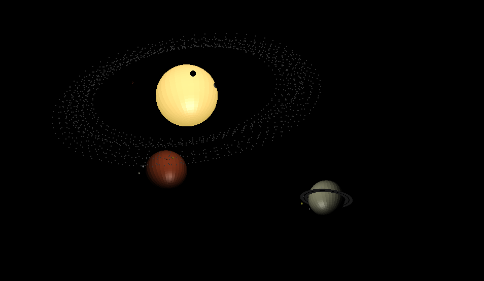
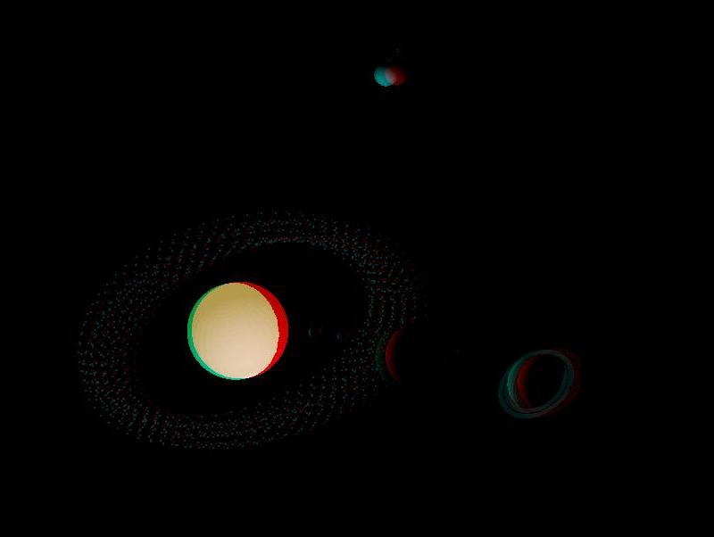

# Solar system 3d model

The project represents a 3D model of Solar system on python. The Solar system includes The Sun, all planets of system with its satellites and the asteroid belt.

### Used technologies

Python 2.7 and Blender (a free and open-source 3D computer graphics software tool set)

### The 2d view of the Solar system model

### The 3d view of the Solar system model (need blue-green 3d glasses)

